# Judiciary Information System (JIS)

## 📌 Project Overview

The **Judiciary Information System (JIS)** is a web-based application developed to modernize and streamline court case management for the Attorney General’s Office. The system replaces traditional paper-based record keeping with a secure, centralized, and efficient digital platform.

JIS enables different judicial stakeholders—**Police, Court Registrars, Judges, Lawyers, and Public Prosecutors**—to manage, track, and access court case information according to their roles.

---

## 🎯 Objectives

* Automate court case registration and management
* Generate unique **Case Identification Numbers (CIN)**
* Enable efficient scheduling and tracking of hearings
* Provide secure access to historical case records
* Reduce delays and prevent data loss
* Support transparency and accountability in judicial processes

---

## 👥 User Roles

* **Police** – Post new cases and view case status
* **Court Registrar** – Manage cases, assign judges/lawyers, upload documents, schedule hearings
* **Judge** – View assigned cases, access past cases, post final verdicts
* **Lawyer** – View assigned cases, access previous cases (chargeable)

---

## ⚙️ Features

* Case registration with automatic CIN generation
* Role-based login and access control
* Case assignment to judges, lawyers, or public prosecutors
* Upload and manage documents of proof
* Hearing date scheduling and updates
* Case status tracking
* Access to historical case records
* Posting of final verdicts

---

## 🧩 System Architecture

The Judiciary Information System follows an MVC-based architecture:

* **Frontend (View):** JSP (Java Server Pages)
* **Backend (Controller):** Java Servlets
* **Database (Model):** JDBC (MySQL / compatible RDBMS)
* **Styling:** Tailwind CSS
* **Server:** Apache Tomcat

---

## 🗂️ UML & Diagrams

* Context Diagram
* Use Case Diagram
* ER Diagram

(Refer to the `documentation/` folder for detailed diagrams and reports.)

---

## 🛠️ Technology Stack

* **Frontend:** JSP
* **Backend:** Java Servlets
* **Database:** JDBC (MySQL)
* **Styling:** Tailwind CSS
* **Server:** Apache Tomcat
* **IDE:** NetBeans
* **OS:** Windows

---

## 🚀 Deployment

This project is deployed locally using **Apache Tomcat**.

### Local Deployment Steps:

1. Install JDK and Apache Tomcat
2. Open the project in NetBeans
3. Clean and Build the project to generate a `.war` file
4. Deploy the project on Tomcat server
5. Access via:

```
http://localhost:8080/JIS
```

> Note: Online cloud deployment requires a VM-based hosting service. This project currently supports local deployment.

---

## 📸 Screenshots

### 🔐 Login Page
[View Login Page](Screenshots/login_page.png)  
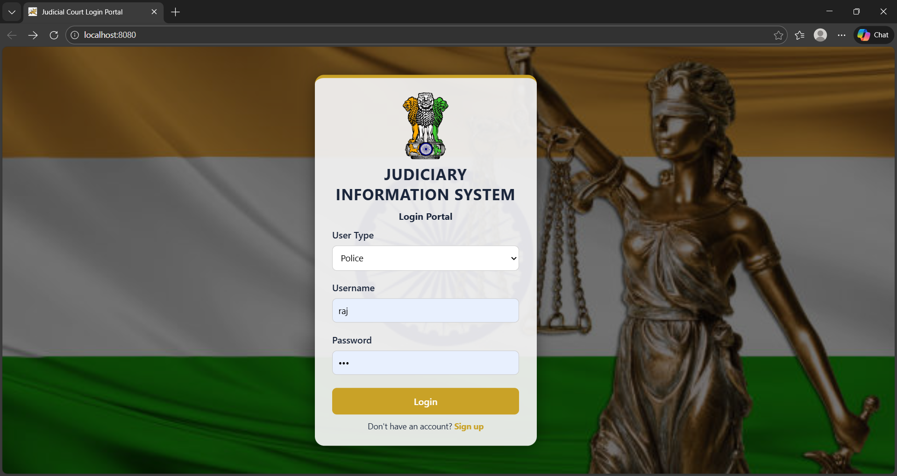

---

### 👮 Post Case (Police)
[View Police Post Case](Screenshots/police_post_case.png)  
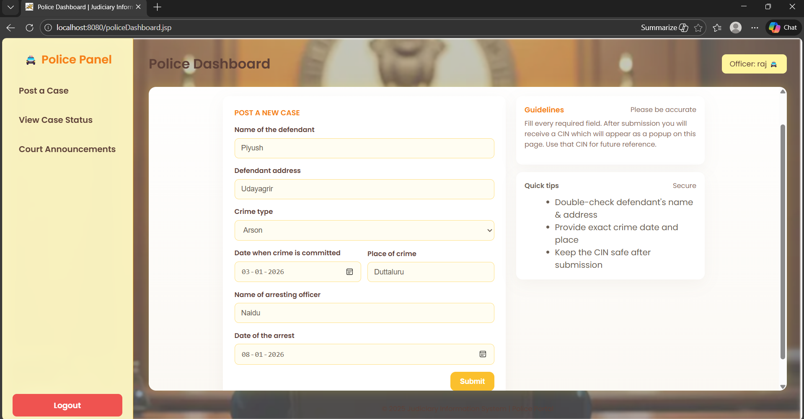

---

### 📊 View Case Status (Police)
[View Case Status](Screenshots/police_view_case_status.png)  
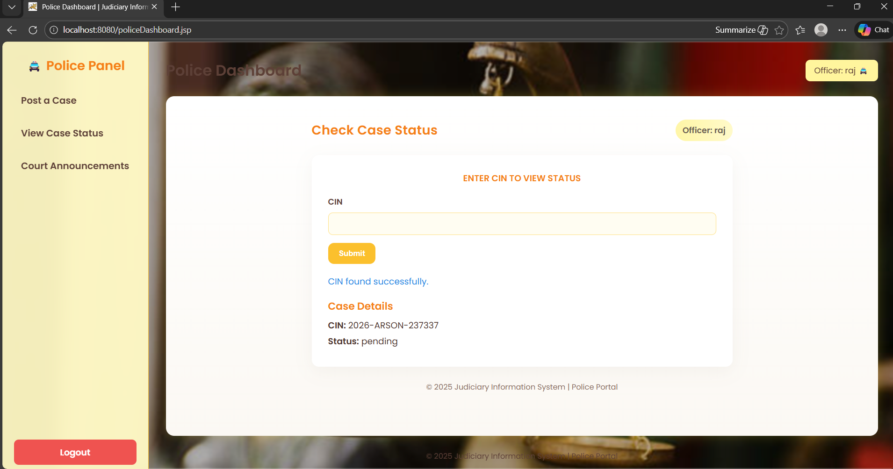

---

### 🗂️ Registrar Dashboard
[View Registrar Dashboard](Screenshots/registrar_dashboard.png)  
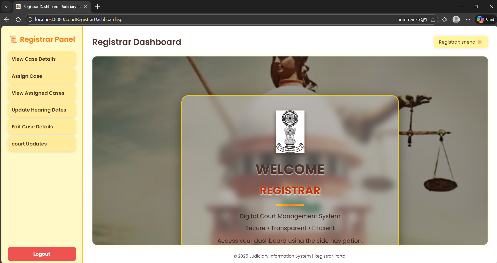

---

### 🧑‍💼 Assign Case (Registrar)
[View Assign Case](Screenshots/registrar_assign_case.png)  
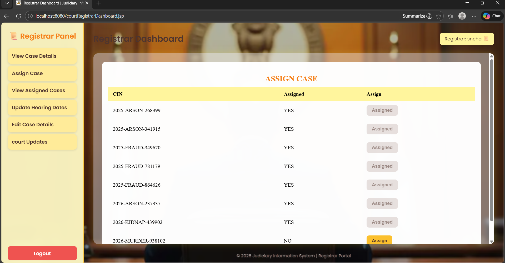

---

### 📅 Update Hearing Dates
[View Hearing Dates](Screenshots/registrar_upload_hearing_dates.png)  
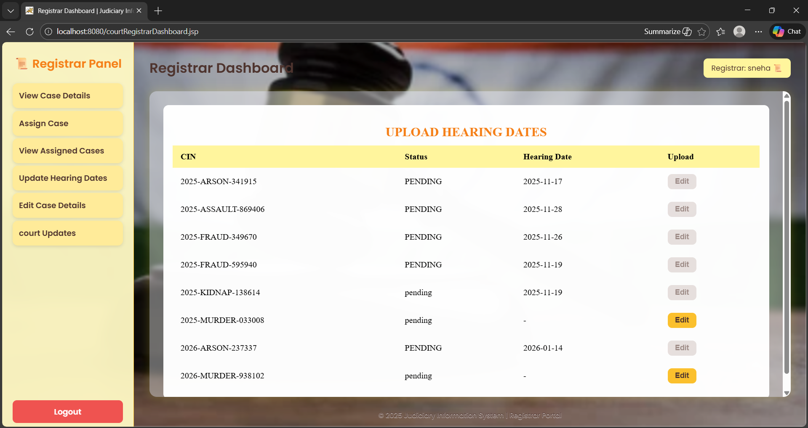

---

### ⚖️ Judge Dashboard
[View Judge Dashboard](Screenshots/judge_dashboard.png)  
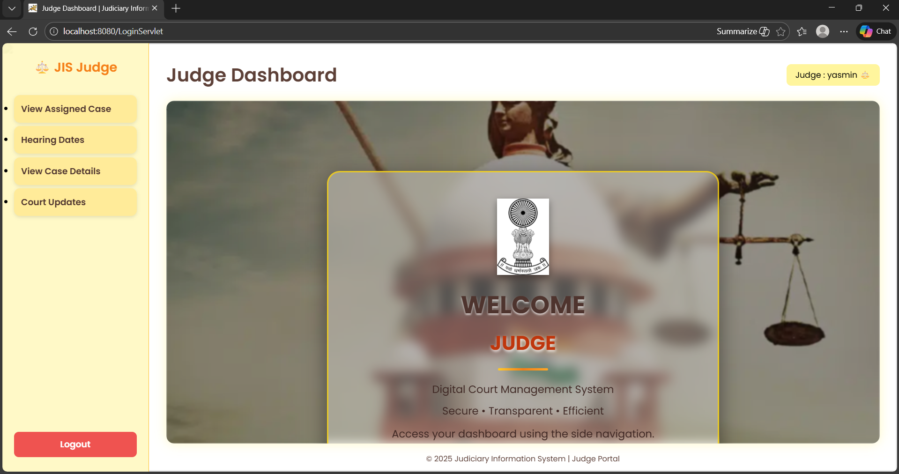

---

### 📂 Judge – View Assigned Cases
[View Assigned Cases](Screenshots/judge_view_assigned_case.png)  
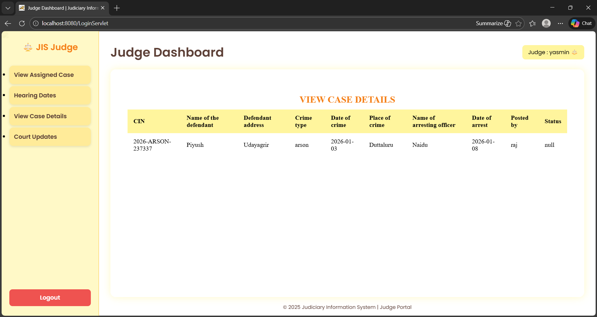

---

### 👨‍⚖️ Lawyer Dashboard
[View Lawyer Dashboard](Screenshots/lawyer_dashboard.png)  
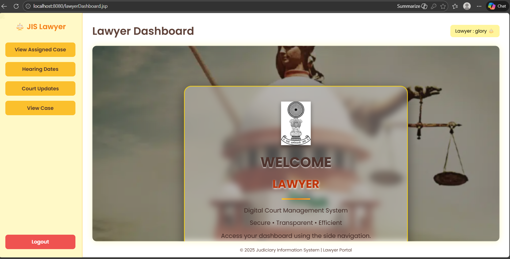

---

### 💳 Lawyer Payment Page
[View Payment Page](Screenshots/lawyer_payment.png)  
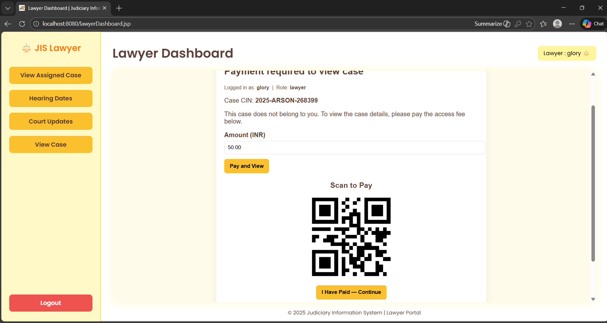

---

### 🆔 Case Identification Number (CIN) Generation
[View CIN Generation](Screenshots/cin_generation.png)  
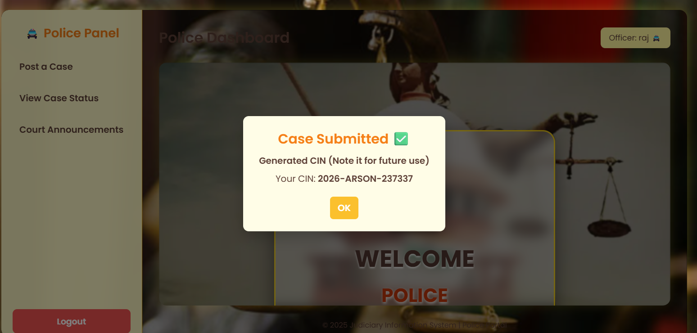

---

### 🗓️ Calendar View
[View Calendar](Screenshots/calendar.png)  
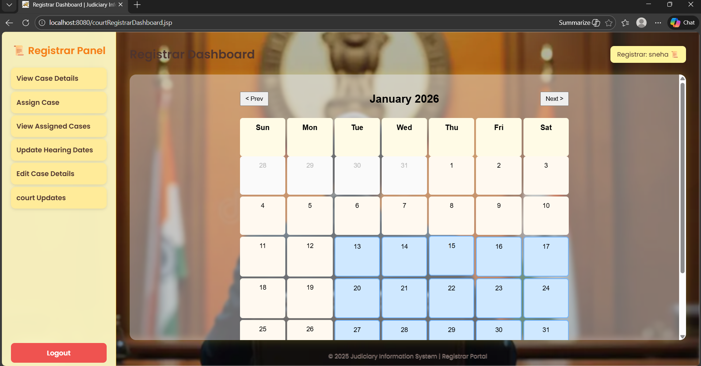


### 🔐 Login Page

* Role-based login for Police, Court Registrar, Judge, and Lawyer.

### 📝 Post Case (Police)

* Police can enter case details and submit a new case.
* System automatically generates a **Case Identification Number (CIN)**.

### 📊 View Case Status

* Users can check the current status of a case using CIN.

### 🗂️ Registrar Dashboard

* View all cases
* Assign cases to Judge/Lawyer/Public Prosecutor
* Upload documents of proof
* Update hearing dates and case status

### ⚖️ Judge Dashboard

* View assigned cases
* Access previous case records
* Post final verdict

### 👨‍⚖️ Lawyer Dashboard

* View assigned cases
* Access historical case details

> 📌 *Note:* Actual screenshots can be found in the `screenshots/` folder of this repository.

---
### Project structure

JISDemo/
├── build/                  # Compiled classes and temporary build files
├── dist/                   # Generated WAR file for deployment
├── documentation/          # Project documents (URD, SRS, Report, Diagrams)
├── nbproject/              # NetBeans project configuration files
├── Screenshots/            # UI screenshots used in README
├── src/                    # Java source files (Servlets, DB logic)
├── test/                   # Test cases and testing files
├── web/                    # JSP pages, CSS, JS, and static resources
├── build.html              # Build-related configuration file
└── README.md               # Project documentation (this file)


---

## 📄 Documentation Included

* User Requirement Document (URD)
* Software Requirements Specification (SRS)
* Project Report
* Use Case, Context, and ER Diagrams

---

## 👨‍💻 Team – IDEA ARCHITECTS

* **M. Sneha**
* **B. Glory**
* **G. Niharika**
* **B. Tejasree**

---

## 📝 Academic Details

* **Course:** Software Engineering Lab
* **Institution:** RGUKT IIIT RK Valley
* **Academic Year:** 2025–2026

---

## ✅ Conclusion

The Judiciary Information System (JIS) demonstrates how web technologies like JSP, Servlets, and JDBC can be effectively used to build a real-world, role-based, and scalable judicial management system. The project emphasizes software engineering principles, documentation, and system design.

---

## 📜 License

This project is developed for academic purposes only.


